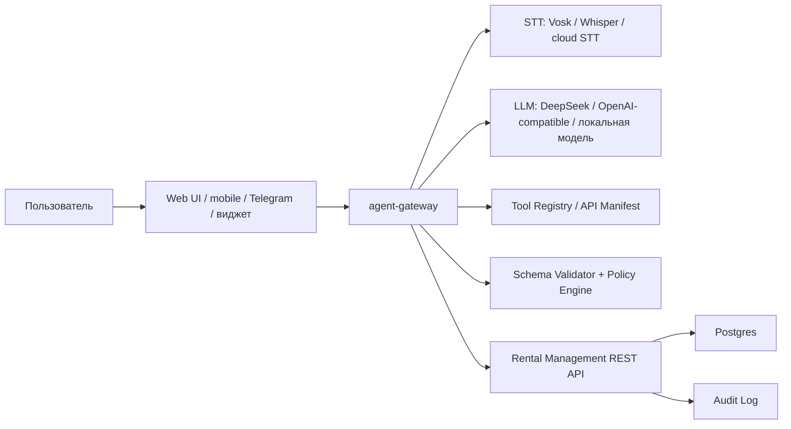

# Экспериментальная фича: голосовой и текстовый агент для управления сервисом

Дата: 2026-06-27

## 1. Краткая суть

Нужен дополнительный агент, который работает как альтернативный интерфейс к Rental Management: пользователь говорит голосом или пишет текстом, агент понимает намерение, собирает недостающие данные, обязательно запрашивает подтверждение и только после этого вызывает REST API приложения от имени пользователя.

Пример:

> "Создай нового арендатора. Зовут Мария Иванова, телефон +7 900 111-22-33."

Агент должен:

1. Распознать намерение: `create_tenant`.
2. Извлечь поля: `fullName`, `phone`.
3. Проверить, хватает ли данных по контракту операции.
4. Если данных хватает, показать пользователю план: "Создать арендатора Мария Иванова, телефон ...?"
5. После подтверждения вызвать `POST /api/tenants`.
6. Вернуть результат: "Арендатор создан."
7. В аудите Rental Management должна быть пометка, что изменение выполнено через агента.

Фичу не нужно сразу реализовывать внутри текущего frontend/backend. Правильнее проектировать ее как отдельный переносимый слой.

## 2. Цели

- Ускорить ежедневные операции для арендодателя: добавить арендатора, объект, платеж, заявку, расход, заметку, изменить статус.
- Дать два режима ввода: голос и текст.
- Сохранить контроль пользователя: любые изменяющие действия выполняются только после подтверждения.
- Не ломать текущую архитектуру Rental Management.
- Сделать агента переносимым: он должен уметь работать с любым проектом, если ему дать описание REST API, правила авторизации и список разрешенных действий.
- Обеспечить аудит: кто, когда, через какой канал и какое действие выполнил.

## 3. Что уже есть на рынке и что можно использовать

### LiveKit Agents

LiveKit Agents — production-ready фреймворк для realtime voice/video/text AI agents. Он поддерживает Python/Node.js, WebRTC, STT/LLM/TTS pipeline, tool use, multi-agent handoff, agent server lifecycle, self-hosted deployment и Kubernetes. Для нас это сильный кандидат, если нужен именно живой голосовой интерфейс в браузере с нормальной обработкой перебиваний и задержек.

Источник: [LiveKit Agents docs](https://docs.livekit.io/agents/)

Плюсы:

- open-source экосистема Apache 2.0;
- WebRTC из коробки;
- голос, текст, мультимодальность;
- tool use, значит можно вызывать наши операции;
- можно self-hosted.

Минусы:

- сложнее MVP, чем обычный текстовый чат;
- потребуется отдельный сервис и настройка realtime транспорта;
- managed cloud может стать платным.

### Pipecat

Pipecat — open-source Python framework для voice/multimodal AI agents. В документации заявлены realtime pipeline, клиентские SDK для web/mobile, Pipecat Flows для структурированных сценариев и возможность self-hosted.

Источник: [Pipecat docs](https://docs.pipecat.ai/overview/introduction)

Плюсы:

- хорошо подходит под voice pipeline;
- структурированные диалоги через flows полезны для сценариев "собери поля -> подтверди -> вызови API";
- Python удобен для интеграции STT/LLM/TTS.

Минусы:

- еще один runtime рядом с Java/Spring;
- для простого MVP можно быть избыточным.

### Vosk

Vosk — offline speech recognition toolkit, поддерживает русский язык, streaming API, Python/Java/C#/JS bindings, работает локально и на легких устройствах. Это хороший бесплатный вариант STT, если важна стоимость и независимость от облаков.

Источник: [Vosk official site](https://alphacephei.com/vosk/)

Плюсы:

- бесплатно и offline;
- русский язык есть;
- можно не отправлять голос внешнему провайдеру;
- streaming API.

Минусы:

- качество хуже топовых облачных STT на шумной речи;
- потребуется тестировать русские команды на реальных пользователях;
- для UX "как живой помощник" может быть недостаточно без хорошей постобработки.

### DeepSeek API

DeepSeek API поддерживает tool calls/function calling и JSON output. По текущей документации 2026 года `deepseek-v4-flash` стоит $0.14 за 1M input tokens при cache miss и $0.28 за 1M output tokens; cache hit сильно дешевле. Для нашей задачи это хороший дешевый LLM-кандидат, особенно если использовать короткий системный prompt и кэшируемое описание tools.

Источники:

- [DeepSeek Tool Calls / Function Calling](https://api-docs.deepseek.com/guides/function_calling)
- [DeepSeek Models & Pricing](https://api-docs.deepseek.com/quick_start/pricing)

Плюсы:

- низкая цена;
- OpenAI-compatible API;
- tool calls и JSON output подходят под диспетчер операций.

Минусы:

- внешний сервис, персональные данные могут уходить третьей стороне;
- нужно проверить юридические и инфраструктурные риски для РФ;
- для чувствительных данных нужно маскирование/минимизация.

### Rasa / классические NLU-боты

Rasa исторически подходит для intent/entity extraction и dialogue management. Но для нашей задачи с большим числом REST-операций и свободной речью LLM + schema validation обычно быстрее в разработке. Rasa можно рассмотреть, если потребуется полностью локальная NLU-система без внешних LLM.

Источник: [Rasa paper / open-source NLU and dialogue management](https://arxiv.org/abs/1712.05181)

## 4. Рекомендованная архитектура

Рекомендуемый вариант: отдельный сервис `agent-gateway`.



### Компоненты

`agent-gateway`

- Отдельный backend-сервис, предпочтительно Python или Node.js.
- Принимает текстовые сообщения и голосовые chunks.
- Управляет состоянием диалога.
- Хранит pending action до подтверждения.
- Вызывает REST API основного приложения только после подтверждения.

`Tool Registry`

- Описание разрешенных операций.
- Источник: OpenAPI текущего backend + ручной allowlist.
- Не все REST endpoints надо отдавать агенту. Только безопасные и понятные пользовательские команды.

`Policy Engine`

- Проверяет права, лимиты, tenant/account scope.
- Запрещает опасные действия без усиленного подтверждения.
- Может запрещать delete-операции на первом этапе.

`Schema Validator`

- Проверяет обязательные поля.
- Нормализует телефон, даты, суммы.
- Не дает LLM напрямую выполнять запросы.

`Audit Marker`

- Каждый запрос от агента должен передавать служебный признак:
  - `X-Actor-Channel: AI_AGENT`
  - `X-Agent-Session-Id: ...`
  - `X-Agent-Intent: create_tenant`
  - `X-Agent-Confirmation-Id: ...`
- Backend в `AuditService` должен сохранять `channel=AI_AGENT`, `agentSessionId`, `rawIntent` или `summary`.

## 5. Авторизация и работа от имени пользователя

Ключевое требование: агент делает изменения не "от себя", а от имени конкретного пользователя.

### Вариант A: reuse пользовательского JWT

Frontend получает JWT после логина и передает его агенту для конкретной сессии. Агент вызывает Rental Management API с `Authorization: Bearer <user-jwt>`.

Плюсы:

- просто;
- backend уже понимает пользователя;
- аудит остается привязан к текущему пользователю.

Минусы:

- агент получает полноценный пользовательский токен;
- нужен короткий TTL и аккуратное хранение;
- риск шире, чем нужно.

### Вариант B: agent session token

Backend Rental Management выдает специальный короткоживущий токен для агента:

`POST /api/agent/sessions`

Ответ:

```json
{
  "agentSessionToken": "...",
  "expiresAt": "2026-06-27T12:30:00Z",
  "scopes": ["tenant:create", "payment:create", "maintenance:create"]
}
```

Агент вызывает API с этим токеном. Backend восстанавливает пользователя и разрешенные scopes.

Плюсы:

- безопаснее;
- можно ограничить agent scopes;
- можно отозвать только agent-сессию;
- удобно логировать канал.

Минусы:

- нужна доработка backend авторизации.

Рекомендация: для production делать вариант B. Для прототипа можно временно использовать A, но только локально/на закрытом стенде.

## 6. Как агент должен понимать доступные REST-запросы

Не надо давать LLM "свободный доступ" ко всему API. Нужен декларативный manifest:

```yaml
version: 1
service: rental-management
tools:
  - name: create_tenant
    method: POST
    path: /api/tenants
    scope: tenant:create
    confirmation: required
    description: Создать арендатора
    required:
      - fullName
      - phone
    schema:
      fullName:
        type: string
        label: ФИО
      phone:
        type: string
        format: ru_phone
        label: Телефон
      email:
        type: string
        format: email
        optional: true
      notes:
        type: string
        optional: true
```

Такой manifest можно генерировать частично из OpenAPI, но финальный allowlist лучше вести руками. Это снизит риск, что агент начнет дергать технические или опасные endpoints.

## 7. Диалоговая модель

Состояния:

1. `IDLE` — ждем команду.
2. `INTENT_DETECTED` — намерение распознано.
3. `COLLECTING_FIELDS` — не хватает обязательных данных.
4. `READY_FOR_CONFIRMATION` — все поля собраны, показываем пользователю план.
5. `CONFIRMED` — пользователь подтвердил.
6. `EXECUTING` — выполняем REST-запрос.
7. `DONE` — действие выполнено.
8. `FAILED` — ошибка, показываем понятное сообщение.
9. `CANCELLED` — пользователь отменил.

Пример диалога:

Пользователь:

> Создай арендатора Мария Иванова, телефон 79001112233.

Агент:

> Я создам арендатора: Мария Иванова, телефон +7 900 111-22-33. Подтвердить?

Пользователь:

> Да.

Агент:

> Готово, арендатор создан.

Если данных не хватает:

Пользователь:

> Создай арендатора Мария.

Агент:

> Не хватает телефона. Скажите телефон арендатора.

## 8. Первые команды для MVP

На первом этапе нельзя брать все операции. Нужно начать с понятных и обратимых/низкорисковых:

- создать арендатора;
- создать объект;
- создать платеж;
- отметить платеж оплаченным;
- создать заявку на обслуживание;
- создать расход;
- добавить комментарий/заметку;
- показать ближайшие платежи;
- показать просрочки;
- показать краткую финансовую сводку.

На первом этапе лучше запретить:

- удаление записей;
- массовые операции;
- изменение тарифов/биллинга;
- выгрузку документов;
- операции с персональными данными без явного подтверждения.

## 9. Подтверждение действий

Все изменяющие операции должны иметь подтверждение. Формат подтверждения:

```json
{
  "confirmationId": "uuid",
  "intent": "create_tenant",
  "actionText": "Создать арендатора Мария Иванова",
  "payloadPreview": {
    "ФИО": "Мария Иванова",
    "Телефон": "+7 900 111-22-33"
  },
  "expiresAt": "2026-06-27T12:35:00Z"
}
```

Подтверждение должно жить коротко: 2-5 минут.

Голосовое подтверждение допустимо словами:

- "да";
- "подтверждаю";
- "создай";
- "сохрани";

Но для опасных операций лучше требовать кнопку в UI, а не только голос.

## 10. Безопасность

Риски:

- LLM неправильно понял команду;
- пользователь сказал одно, а агент выполнил другое;
- prompt injection через текстовые поля;
- утечка персональных данных во внешний LLM/STT;
- агент получил слишком широкий доступ;
- replay старого подтверждения;
- выполнение действия без пользователя.

Контрмеры:

- allowlist операций;
- schema validation вне LLM;
- подтверждение перед любым write action;
- короткий TTL confirmation;
- agent session token со scopes;
- audit marker;
- запрет delete/mass actions на MVP;
- rate limits на agent sessions;
- хранить raw transcript ограниченное время;
- маскировать паспортные данные, токены, секреты;
- для внешнего LLM отправлять минимум контекста, без лишних данных аккаунта.

## 11. Персональные данные и РФ

Так как агент будет обрабатывать ФИО, телефоны, email, адреса объектов, комментарии и возможно документы, это персональные данные по 152-ФЗ.

Для production нужно:

- указать в политике обработки ПДн, что данные могут обрабатываться голосовым/текстовым агентом;
- получить согласие пользователя на такую обработку;
- отдельно оценить передачу данных внешним LLM/STT провайдерам;
- для РФ-рынка предпочтительно иметь режим без передачи голоса/ПДн за рубеж: локальный STT + self-hosted LLM или минимизированные запросы;
- логировать факт обработки, но не хранить голосовые записи без необходимости;
- дать настройку отключения агента на уровне аккаунта.

## 12. Рекомендованный технический стек для прототипа

### Минимальный текстовый MVP

- `agent-gateway`: Python FastAPI или Node.js.
- LLM: DeepSeek API через OpenAI-compatible client.
- Tool execution: HTTP client к Rental Management API.
- Tool manifest: YAML/JSON в репозитории.
- State store: Redis или Postgres.
- UI: чат-панель внутри текущего frontend.

Это самый быстрый способ проверить ценность фичи.

### Голосовой MVP

Вариант 1, дешевле:

- STT: Vosk offline Russian.
- LLM: DeepSeek.
- TTS: браузерный Web Speech API или Silero TTS.
- Transport: обычная запись аудио chunks через WebSocket.

Вариант 2, лучше UX:

- LiveKit Agents или Pipecat.
- STT: Vosk/Whisper/cloud STT.
- LLM: DeepSeek/OpenAI-compatible.
- TTS: Silero/ElevenLabs/другой провайдер.
- Transport: WebRTC.

Рекомендация: начать с текстового MVP, затем добавить голосовой ввод как слой поверх той же логики. Не смешивать voice pipeline и бизнес-логику.

## 13. Предлагаемые backend-доработки Rental Management

Чтобы агент был правильно встроен:

1. Добавить `agent_sessions`:
   - `id`;
   - `account_id`;
   - `user_id`;
   - `scopes`;
   - `expires_at`;
   - `revoked_at`;
   - `created_at`.

2. Добавить endpoint:
   - `POST /api/agent/sessions`;
   - `DELETE /api/agent/sessions/{id}`;
   - `GET /api/agent/tools` для выдачи manifest с учетом прав пользователя.

3. Расширить аудит:
   - `channel`: `UI`, `API`, `AI_AGENT`, `WORKER`;
   - `agent_session_id`;
   - `agent_intent`;
   - `confirmation_id`.

4. Добавить поддержку заголовков:
   - `X-Actor-Channel`;
   - `X-Agent-Session-Id`;
   - `X-Agent-Intent`;
   - `X-Agent-Confirmation-Id`.

5. Ввести scopes для agent-token:
   - `tenant:create`;
   - `object:create`;
   - `payment:create`;
   - `payment:update`;
   - `maintenance:create`;
   - `expense:create`;
   - `dashboard:read`.

## 14. Agent-gateway API

Текст:

```http
POST /agent/message
Authorization: Bearer <agent-session-token>
Content-Type: application/json
```

```json
{
  "channel": "TEXT",
  "message": "Создай арендатора Мария Иванова, телефон 79001112233"
}
```

Голос:

```http
POST /agent/audio
Authorization: Bearer <agent-session-token>
Content-Type: multipart/form-data
```

Ответ:

```json
{
  "state": "READY_FOR_CONFIRMATION",
  "reply": "Я создам арендатора Мария Иванова, телефон +7 900 111-22-33. Подтвердить?",
  "confirmation": {
    "id": "uuid",
    "intent": "create_tenant",
    "payload": {
      "fullName": "Мария Иванова",
      "phone": "+7 900 111-22-33"
    }
  }
}
```

Подтверждение:

```http
POST /agent/confirm
Authorization: Bearer <agent-session-token>
```

```json
{
  "confirmationId": "uuid",
  "answer": "yes"
}
```

## 15. LLM prompt policy

LLM нельзя просить "самому выполнить API". Он должен вернуть только структурированный JSON:

```json
{
  "intent": "create_tenant",
  "confidence": 0.91,
  "fields": {
    "fullName": "Мария Иванова",
    "phone": "79001112233"
  },
  "missingFields": [],
  "needsConfirmation": true,
  "userReply": "Я создам арендатора Мария Иванова..."
}
```

Затем backend-agent сам валидирует и решает, что делать.

## 16. Нормализация данных

Обязательно отдельно от LLM:

- телефон РФ -> E.164 `+79001112233`;
- суммы -> decimal RUB;
- даты -> ISO `YYYY-MM-DD`;
- "завтра", "5 числа", "в следующем месяце" -> дата с учетом timezone аккаунта;
- статусы -> enum backend;
- ФИО -> строка без лишних символов;
- комментарии -> plain text, лимиты длины.

## 17. Что считать успехом MVP

Метрики:

- доля команд, которые агент понял без уточнений;
- среднее число уточнений до выполнения;
- доля отмененных подтверждений;
- ошибки выполнения REST;
- время от команды до результата;
- какие команды используют чаще всего;
- сколько операций пользователь сделал через агента вместо UI.

Критерий запуска beta:

- 90% успешных операций на 5-7 основных командах;
- 0 операций без подтверждения;
- 100% write actions попадают в аудит с `AI_AGENT`;
- пользователь может посмотреть, что именно агент сделал.

## 18. Пошаговый план внедрения

### Этап 1. Аналитический прототип без голоса

1. Подготовить tool manifest для 5 команд.
2. Сделать `agent-gateway` с текстовым `/message`.
3. Подключить DeepSeek tool calls / JSON output.
4. Реализовать сбор полей и подтверждение.
5. Вызывать REST API текущего backend.
6. Добавить audit marker.

### Этап 2. UI чат внутри Rental Management

1. Добавить кнопку "Ассистент".
2. Сделать чат-панель.
3. Показывать confirmation card.
4. Отображать результат и ссылку на созданную запись.

### Этап 3. Голосовой ввод

1. Добавить запись голоса в браузере.
2. Подключить STT.
3. Использовать тот же `/message` pipeline после транскрибации.
4. Добавить TTS-ответ опционально.

### Этап 4. Production hardening

1. Agent session token со scopes.
2. Rate limits.
3. Observability.
4. Red-team тесты prompt injection.
5. Настройки приватности и хранение transcript.

## 19. Что не делать сейчас

- Не давать агенту полный OpenAPI без allowlist.
- Не делать удаление записей голосом.
- Не хранить голосовые записи бессрочно.
- Не отправлять в LLM всю базу аккаунта.
- Не смешивать агентную бизнес-логику с React-компонентами.
- Не давать LLM самому формировать произвольные HTTP-запросы.

## 20. Резюме рекомендации

Лучший путь:

1. Делать агента отдельным сервисом `agent-gateway`.
2. Начать с текстового режима, потому что он проверит главную ценность без сложности voice realtime.
3. Для LLM взять DeepSeek API как дешевый OpenAI-compatible вариант с tool calls/JSON output.
4. Для голосового MVP рассмотреть Vosk как бесплатный STT, а для более качественного realtime UX — LiveKit Agents или Pipecat.
5. В Rental Management добавить agent session token, scopes и audit marker.
6. Все write actions выполнять только через подтверждение.

Это даст переносимую архитектуру: в будущем агент сможет подключаться к другим проектам через новый manifest команд и адаптер авторизации, без переписывания ядра агента.

